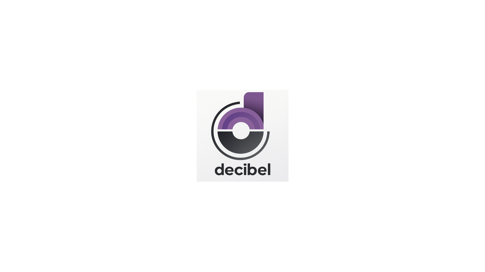

# Decibel

<p align="center">
  
</p>


**A Full-Stack Music Streaming Mobile App**  
_Built with Flutter (MVVM) + FastAPI | Powered by PostgreSQL, SQLAlchemy, and Cloudinary_

---

## Overview  

Decibel is a **music streaming mobile application** that delivers a seamless listening experience with **real-time playback**, **user authentication**, and **media management**.  

It’s built with a **Flutter MVVM architecture** for structured state management and a **FastAPI backend** that handles secure media operations, JWT authentication, and database workflows.  

---

## ✨ Features  

- 🎧 **Full-Stack Music Streaming:** Built with Flutter (MVVM) frontend and FastAPI + SQLAlchemy backend.  
- 🔐 **JWT Authentication:** Implemented with Pydantic validation and custom FastAPI middleware for secure routes.  
- 🧩 **State Management:** Used Provider with annotations/code generation for scalable, type-safe state handling.  
- ☁️ **Cloudinary Integration:** Media upload, storage, and retrieval workflows integrated with PostgreSQL for asset URL management.  
- 🔄 **Core App Features:** Background audio playback, listening history, library management, and a floating mini-player for continuous playback.  

---

## 🛠️ Tech Stack  

- **Frontend:** Flutter (MVVM Architecture) + Provider  
- **Backend:** FastAPI + SQLAlchemy  
- **Database:** PostgreSQL  
- **Storage:** Cloudinary  
- **Auth:** JWT with Pydantic validation  

---


## 🧩 MVVM Architecture Overview

The Decibel app follows the **MVVM (Model-View-ViewModel)** pattern for clean separation of concerns, making it easier to scale and maintain.  
Here’s how data and control flow across the app and backend:


## Quick Start

Here's how you can quickly set it up and run the backend (FastAPI) as well as the frontend (Flutter).

---

### 🔹 Backend (FastAPI and SQLAlchemy)

1. Once you clone , cd to the server directory :
   
```bash
   cd server
```
2. In the server directory, create a python virtual environment (Venv). Recommending this to avoid version issues and to make sure one has all the dependencies.

   
```bash
   python -m venv venv
   source venv/bin/activate   # Linux/Mac
   venv\Scripts\activate      # Windows
```

3. Install dependencies from requirements.txt :

   
```bash
   pip install -r requirements.txt
```

4. Start the server :

   
```bash
   uvicorn main:app -reload
```

5. All set :
   If things are good, the backend should now be running.

### 🔹 Frontend (Flutter)

1. cd into the frontend directory

   
```bash
   cd frontend
```

2. Install flutter dependencies :

   
```bash
   flutter pub get
```

3. Run the flutter app
   
```bash
   flutter run
```